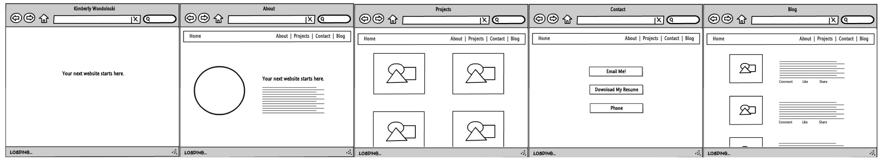

# README

# README

# Kimberly Wondoloski Portfolio

### What is it?
A showcase of my past projects, a blog, and contact info.
Here you will find everything you need to get in touch with me, preview my work, download my resume, and find fresh inspiration from some of my favorite articles and tutorials.

## Wireframe

### How is it made?
* [Ruby](https://www.ruby-lang.org/en/ "ruby.org")
* [Ruby on Rails](http://rubyonrails.org/ "rubyonrails.org")
    * [Devise](https://github.com/plataformatec/devise "Devise docs")

    * Design - Google Fonts
    * IDE - Atom 1.14.2

### Running WanderList Locally
My portfolio is written in Ruby (v 2.3.1).
My portfolio is written in Ruby on Rails (v 5.0.1).

#### Deployed :: [My Portfolio]( "WanderList App")
#### Source Code :: [GitHub](https://github.com/kimberlywondo/kimberly-wondoloski-portfolio "GitHub Repo")
